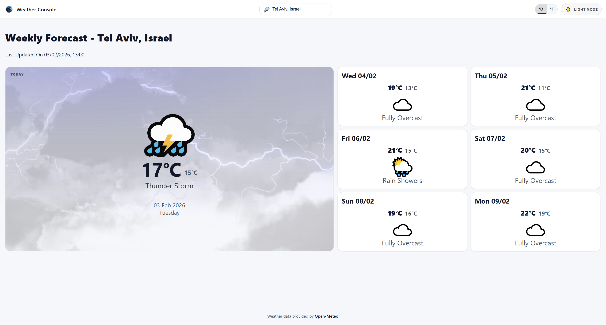
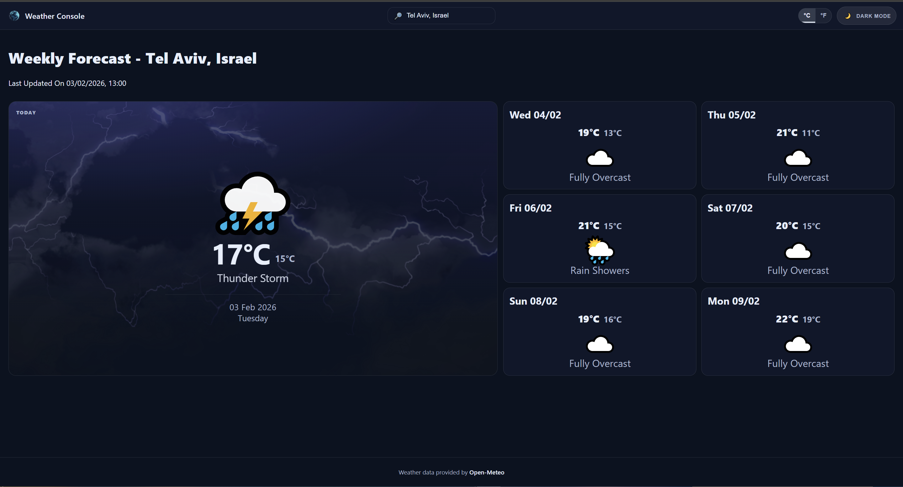
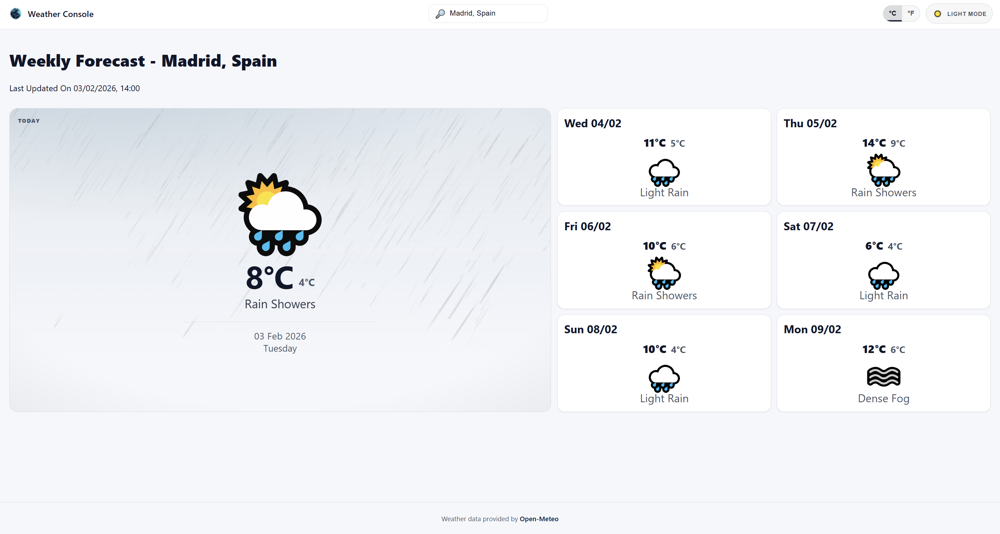
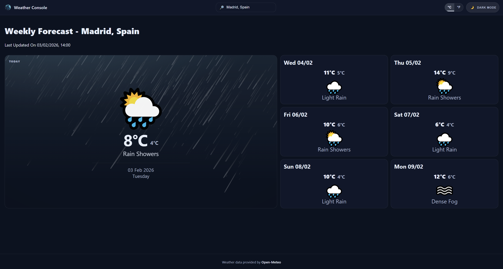
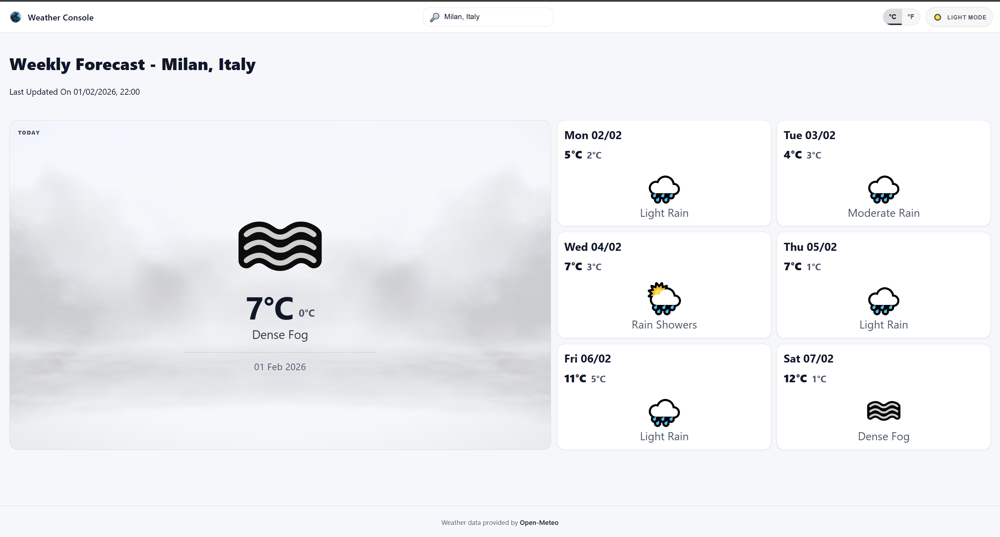
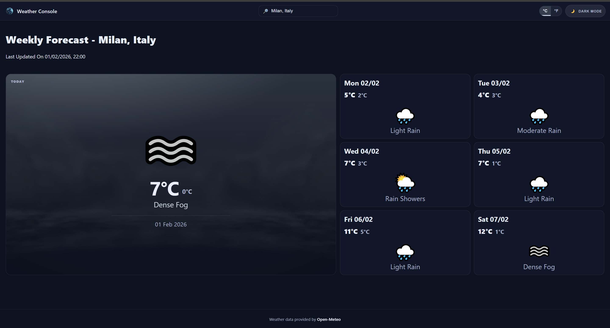

# Weather Console

A full-stack weather data collection and visualization system built as a home assignment.  
The project demonstrates API integration, scheduled backend processing, relational database design, and a responsive React-based user interface.

---

## Assignment Scope & Goals

This project was implemented according to the assignment requirements, with an emphasis on:

- Scheduled backend data collection
- Reliable API integration
- Structured data persistence
- Clear and user-friendly frontend visualization
- Clean, maintainable code with proper error handling

---

## System Overview

The system consists of three clearly separated layers:

- **Frontend** – React + TypeScript (Vite)
- **Backend** – Node.js service with a scheduled hourly task
- **Database** – PostgreSQL for persistent weather data storage

```

Frontend (React UI)
↓
Backend API (Node.js)
↓
Open-Meteo Weather API
↓
PostgreSQL Database

````

Each layer has a single responsibility and communicates through well-defined interfaces.

---

## Backend Implementation

### Scheduled Weather Fetching

- A scheduled task runs **once every hour**
- On each execution, the service:
  1. Selects the next location from the `WeatherOrigins` table
  2. Fetches a **weekly weather forecast** from the Open-Meteo API
  3. Processes and normalizes the raw API response
  4. Persists the processed results into the database

### Location Rotation

Locations are processed in a fixed, predefined order, as required by the assignment:

1. Tel Aviv, Israel  
2. Madrid, Spain  
3. Milan, Italy  
4. Manila, Philippines  
5. Phuket, Thailand  

The rotation logic is handled **server-side**, ensuring:
- Predictable execution order
- Stateless frontend clients
- No duplicated business logic across consumers

---

## Database Design

### WeatherOrigins

Stores the list of locations to query.

- Manually populated as required
- Contains city name, country, and geographic coordinates
- Acts as the source of truth for scheduled fetching

### WeatherResults

Stores processed daily weather data per location.

- One row per location per day
- Includes:
  - Minimum and maximum temperatures
  - Weather codes
  - Fetch timestamps
- Designed for efficient reads by the frontend

---

## Frontend Implementation

### Tech Stack

- React
- TypeScript
- Vite
- CSS Modules
- ESLint

### Visualization & UX

- Weather data is displayed per selected location
- A highlighted **“Today” card** emphasizes the current day
- A weekly forecast grid shows upcoming days
- Fully responsive layout (desktop, tablet, mobile)
- Light and Dark mode with user-controlled toggle
- Temperature unit toggle (Celsius / Fahrenheit)

### State & Data Handling

- Frontend consumes normalized backend data
- Presentation logic is decoupled from raw API responses
- Theme and unit preferences update instantly without page reloads

---

## Error Handling & Resilience

- API failures are surfaced with user-friendly messages and retry options
- Missing or partial data falls back to safe UI states
- A global React ErrorBoundary prevents full UI crashes in case of unexpected runtime errors

---

## Design & Technical Decisions

- **CSS Modules** were chosen to keep styles scoped and predictable without introducing a heavy UI framework
- No global state management library was added, as the application state is localized and manageable with React hooks
- Backend logic uses minimal abstractions to keep the scheduled service transparent and easy to reason about
- The project prioritizes clarity and robustness over premature abstraction, given the scope of the assignment

---

## Running the Project

### Frontend

```bash
npm install
npm run dev
````

### Backend

```bash
npm install
npm run start
```

Environment variables and PostgreSQL configuration are required for the backend.

---

## Development Notes

The project was developed incrementally with small, focused commits to reflect a realistic development workflow.

The overall goal was to deliver a solution that is reliable, readable, and easy to extend, while adhering closely to the assignment requirements.

## UI Preview

### Thunder storm Weather




### Rain Showers Weather




### Fog Weather



